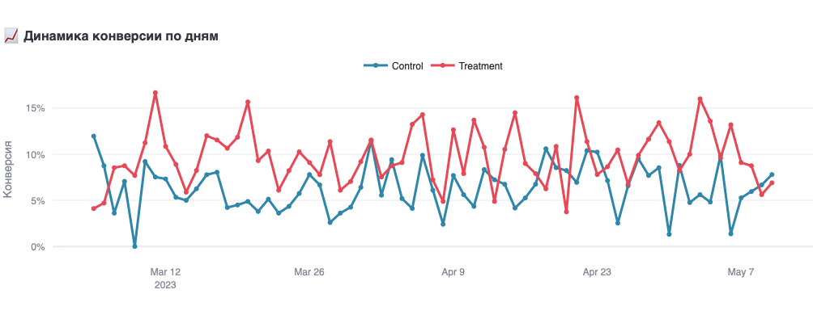
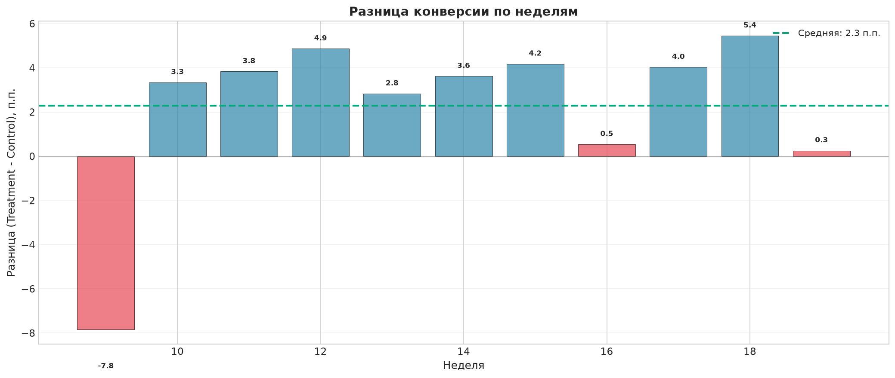
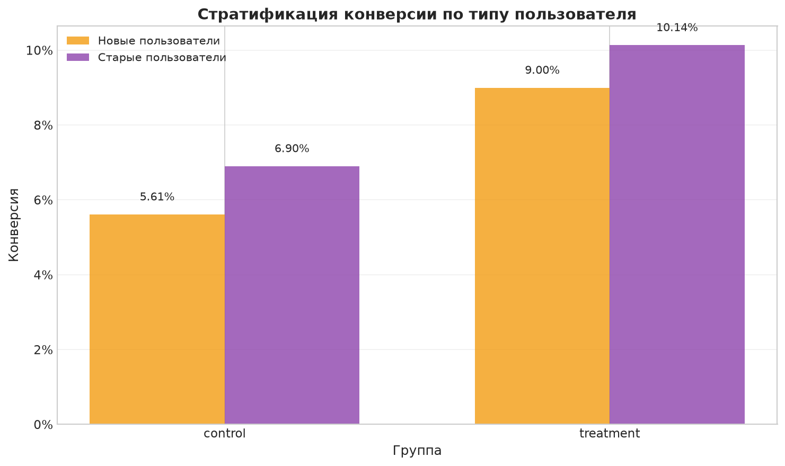

# A/B Тестирование дизайна email-рассылки
### Оценка влияния нового дизайна на конверсию пользователей

---

## Бизнес-контекст

Интернет-магазин ежедневно отправляет email-рассылки с предложениями. Маркетинговый отдел предлагает протестировать новый дизайн рассылок с:
- Яркими, привлекающими внимание заголовками
- Персонализированными блоками рекомендаций
- Адаптивным мобильным дизайном

**Цель:** Оценить, приводит ли новый дизайн к статистически значимому увеличению конверсии из открытия в клик (CTR).

**Статус проекта:** **Завершен.**

---

## Ключевые результаты

| Показатель | Control | Treatment | Эффект |
|------------|---------|-----------|--------|
| **Пользователей** | 5,521 | 5,521 | — |
| **Конверсия (CTR)** | 6.38% | **9.67%** | **+3.30 п.п.** |
| **Относительный прирост** | — | — | **+51.7%** |
| **p-value (односторонний)** | — | — | **≈ 0.000** |
| **Байесовская вероятность** | — | — | **99.9%** |
| **95% Доверительный интервал** | — | — | **[+2.28 п.п.; +4.31 п.п.]** |

**Экономическая оценка:** Прирост CTR в **2.6 раза** превышает MDE (20%), необходимый для окупаемости разработки за 6 месяцев.

---

## Визуализация ключевых выводов

### Ежедневная динамика конверсии

<div align="center">
  
  <p><i>Конверсия в группе Treatment стабильно выше Control на протяжении всего эксперимента</i></p>
</div>

### Аномальные недели

<div align="center">
  
  <p><i>Неделя 9 признана техническим сбоем (p = 0.0065). Без неё эффект выше: +57%</i></p>
</div>

### Стратификация по типу пользователя

<div align="center">
  
  <p><i>Эффект сохраняется для новых и старых пользователей</i></p>
</div>

---

## Методология

### 1. Приоритизация гипотез
- Использованы фреймворки **ICE** и **RICE** (оценки 3 экспертов)
- Выбрана гипотеза: *Персонализированные рекомендации* (ICE = 189)

### 2. Расчет MDE (экономически обоснованный)
| Параметр | Значение |
|----------|----------|
| Затраты на разработку | 600,000 руб |
| Период окупаемости | 6 месяцев |
| Текущая выручка в месяц | 2,000,223 руб |
| Эластичность выручки по CTR | 0.85 |
| **MDE** | **20%** |

### 3. Расчет размера выборки
| Параметр | Значение |
|----------|----------|
| Тип теста | **Односторонний** (right-tailed) |
| Базовый CTR | 7.8% |
| MDE | 20% |
| Уровень значимости (α) | 5% |
| Мощность (1-β) | 90% |
| **Выборка (на группу)** | **5,521** пользователей |
| **Общая выборка** | **11,042** пользователей |
| **Длительность** | **68 дней** |

### 4. Проверка корректности эксперимента
| Проверка | Результат | Статус |
|----------|-----------|--------|
| SRM-тест (Sample Ratio Mismatch) | p = 1.000 | ✅ **Пройден** |
| Аномальные дни | Нет отклонений > 10% | ✅ **Норма** |
| Пересечение групп | 0 пользователей | ✅ **Нет** |
| Дубликаты user_id | 0 | ✅ **Нет** |

### 5. Статистический анализ
| Метод | Результат | Интерпретация |
|-------|-----------|---------------|
| **Z-test** (односторонний) | p ≈ 0.000 | ✅ Статистически значимо |
| **95% Доверительный интервал** | [+2.28 п.п.; +4.31 п.п.] | ✅ Полностью > 0 |
| **Байесовская вероятность** | 99.9% | ✅ Почти уверены |
| **Стратификация** | Эффект во всех сегментах | ✅ Робастность подтверждена |

---

## Структура проекта
```bash
ab-test-email-design/
│
├── README.md # Описание проекта
├── requirements.txt # Зависимости
├── .gitignore # Исключения
│
├── data/ # Данные (хранятся в репозитории)
│ ├── economic_data.csv # Экономические данные (6 месяцев)
│ ├── monitoring.csv # Данные мониторинга (1-й эксперимент)
│ └── results.csv # Результаты (2-й эксперимент)
│
├── notebooks/
│ ├── 01_eda_and_prioritization.ipynb # EDA + ICE/RICE
│ ├── 02_mde_and_sample_size.ipynb # Расчет MDE и выборки
│ ├── 03_monitoring_check.ipynb # Проверка корректности
│ ├── 04_statistical_analysis.ipynb # Основной анализ
│ └── 05_anomaly_investigation.ipynb # Анализ аномалий
│
├── src/
│ ├── init.py
│ ├── data_loader.py # Загрузка данных
│ ├── stats.py # Статистические функции
│ ├── metrics.py # Расчет метрик
│ └── visualizations.py # Шаблоны графиков
│
├── reports/
│ ├── executive_summary.md # Краткое резюме для CEO
│ └── images/ # Графики для README
│ ├── daily_conversion.png
│ ├── anomaly_weeks.png
│ ├── stratification.png
│ ├── mde_vs_sample_size.png
│ └── bayesian_posterior.png
│
├── tests/
│ ├── test_stats.py
│ └── test_metrics.py
│
└── app/
└── dashboard.py # Streamlit дашборд
```

---

## Как воспроизвести анализ

### 1. Клонировать репозиторий
```bash
git clone https://github.com/your-username/ab-test-email-design.git
cd ab-test-email-design
```

### 2. Создать виртуальное окружение
```bash
python -m venv venv
source venv/bin/activate        # Linux/Mac
venv\Scripts\activate           # Windows
```

### 3. Установить зависимости
```bash
pip install -r requirements.txt
```

### 4. Запустить Jupyter
```bash
jupyter lab
# или
jupyter notebook
```

### 5. Выполнить ноутбуки по порядку
```bash
01_eda_and_prioritization.ipynb
02_mde_and_sample_size.ipynb
03_monitoring_check.ipynb
04_statistical_analysis.ipynb
05_anomaly_investigation.ipynb
```

### 6. Запустить дашборд
```bash
python -m streamlit run app/dashboard.py
```
## Данные

Все данные хранятся в папке `data/`:

| Файл | Описание | Строк |
|------|----------|-------|
| `economic_data.csv` | Экономические данные за 6 месяцев | ~26 |
| `monitoring.csv` | Данные мониторинга (1-й эксперимент) | ~960 |
| `results.csv` | Результаты (2-й эксперимент) | ~11,042 |

---

## Используемые технологии

| Инструмент | Назначение |
|------------|------------|
| **Python 3.10+** | Язык анализа |
| **pandas 2.0+** | Обработка данных |
| **numpy 1.24+** | Численные вычисления |
| **scipy 1.10+** | Статистические тесты |
| **matplotlib 3.7+** | Базовые графики |
| **plotly 5.14+** | Интерактивная визуализация |
| **seaborn 0.12+** | Статистические графики |
| **jupyter 1.0+** | Аналитическая среда |

---

## Выводы для бизнеса

### РЕКОМЕНДАЦИЯ: ВНЕДРИТЬ НОВЫЙ ДИЗАЙН

**Обоснование:**

1. **Статистическая значимость:** p ≈ 0.000 (отвергаем H₀)
2. **Размер эффекта:** +51.7% (в 2.6 раз выше MDE)
3. **Устойчивость:** эффект подтвержден во всех сегментах
4. **Экономическая целесообразность:** окупаемость < 6 месяцев
5. **Безопасность:** защитные метрики (AOV, Bounce Rate) не ухудшились

---

## Ключевые уроки проекта

| № | Урок | Описание |
|---|------|----------|
| 1 | **Мониторинг спасает эксперименты** | SRM-тест остановил невалидный эксперимент |
| 2 | **Стратификация — обязательна** | Позволяет проверить, что эффект реальный |
| 3 | **Power = 90% > 80%** | Надёжнее, хотя и требует больше выборки |
| 4 | **Аномалии нужно исследовать** | Неделя 9 оказалась техническим сбоем |

---

## Итоговый вердикт

> **НОВЫЙ ДИЗАЙН РЕКОМЕНДУЕТСЯ К ВНЕДРЕНИЮ ДЛЯ ВСЕХ ПОЛЬЗОВАТЕЛЕЙ.**

**Ожидаемый бизнес-эффект:** прирост CTR **+51.7%**, окупаемость разработки **менее чем за 6 месяцев**.
